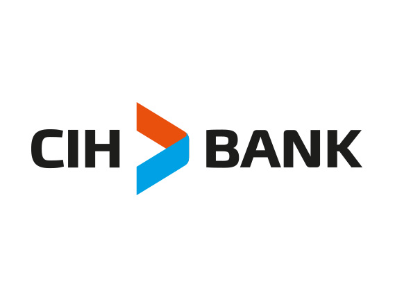

# 🏦 CIH Bank RAG Chatbot

An intelligent, conversational search assistant (RAG) designed to answer questions about CIH Bank's products, services, and loans. Built with Python, LangChain, ChromaDB, and Streamlit.



## Features

- **Automated Web Scraping**: Dynamically extracts up-to-date information across +100 CIH Bank URLs, including detailed documentation for individual and corporate credits (Auto, Immobilier, Consommation, etc.).
- **Smart Data Cleaning**: Deduplicates website headers, footprints, and navigation artifacts to preserve high-quality LLM context context.
- **Semantic Vector Storage**: Leverages ChromaDB and HuggingFace's `paraphrase-multilingual-MiniLM-L12-v2` to vectorize banking terminology.
- **Conversational Memory**: Remembers previous questions in the session (via LangChain `MessagesPlaceholder`), allowing multi-turn, contextual conversations.
- **Premium UI**: Modern, aesthetic Streamlit interface customized with official CIH Bank branding (Deep Blue & Orange) and seamless chat bubble animations.

## Architecture

1. **Scraping Layer** (`scraper/cih_scraper.py`): Downloads HTML from CIH pages.
2. **Cleaning Layer** (`scraper/data_cleaner.py`): Cleans and formats raw texts into pure corpus JSON.
3. **Indexing Layer** (`rag/indexer.py`): Chunks text and embeds it into the localized `chroma_db_v3` database.
4. **Retrieval Layer** (`rag/retriever.py`): Uses Maximum Marginal Relevance (MMR) search to fetch related document chunks.
5. **LLM Chain Layer** (`rag/chain.py`): Compiles context and chat history into a seamless Groq LLM prompt.
6. **Frontend App** (`rag/app.py`): The interactive user interface built heavily with Streamlit.

## Installation & Setup

1. **Clone the repository:**
   ```bash
   git clone https://github.com/RedaMohssine/cih_chatbot_shadowing.git
   cd cih_chatbot_shadowing
   ```

2. **Create a virtual environment and install dependencies:**
   ```bash
   python -m venv venv
   source venv/bin/activate  # On Windows use: venv\Scripts\activate
   pip install -r scraper/requirements.txt
   ```

3. **Configure the API Key:**
   Export your Groq API key (or put it in the Streamlit UI popup):
   ```bash
   export GROQ_API_KEY="your_api_key_here"
   ```

4. **Initialize the Vector Store:**
   Generate the ChromaDB context (this will take a few minutes):
   ```bash
   cd scraper
   python cih_scraper.py
   python data_cleaner.py
   cd ../rag
   python indexer.py
   ```

5. **Run the Application:**
   Launch the premium web UI:
   ```bash
   cd rag
   streamlit run app.py
   ```

##  Author

Made by **Mohamed Mohssine** (Reda).
